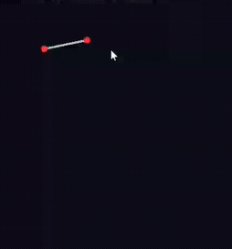
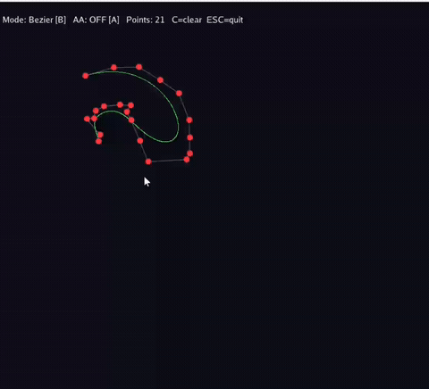
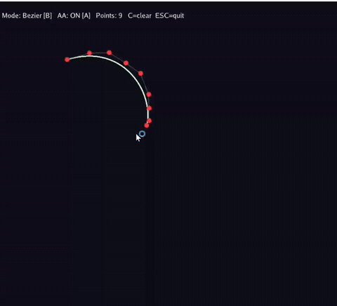

# 实验3：贝塞尔曲线

## 实验简介

基于 Taichi 实现交互式贝塞尔曲线绘制系统，包含 De Casteljau 算法、反走样和 B 样条曲线。

## 效果演示

### 基础任务：贝塞尔曲线（De Casteljau 算法）



### 选做1：反走样对比



### 选做2：B 样条曲线



## 操作说明

| 按键 | 功能 |
|------|------|
| 鼠标左键 | 添加控制点 |
| `C` | 清空所有控制点 |
| `B` | 切换 贝塞尔 / B样条 模式 |
| `A` | 切换 反走样 开/关 |
| `ESC` | 退出 |

## 运行方式

```bash
pip install taichi
python main.py
```

## 实现说明

### 基础：De Casteljau 算法

对 n 个控制点递归进行线性插值：相邻点之间取比例 t 处的点，
重复直到只剩一个点，即曲线在参数 t 处的坐标。
采样 1001 个点后批量传入 GPU 并行绘制（Batching）。

### 选做1：反走样

对每个曲线点周围 3×3 像素邻域，按像素中心到精确坐标的距离
做高斯衰减加权（σ=0.8），实现平滑边缘过渡，消除阶梯锯齿。

### 选做2：均匀三次 B 样条

使用固定基矩阵分段计算，每 4 个相邻控制点构成一段三次曲线，
n 个控制点生成 n-3 段平滑拼接。具有局部控制特性：
移动一个控制点只影响相邻曲线段，不影响整体形状。

### 实验说明：
- 本实验适用于北师大人工智能学院计算机图形学实验三作业