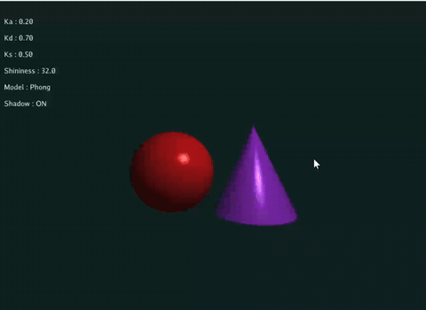
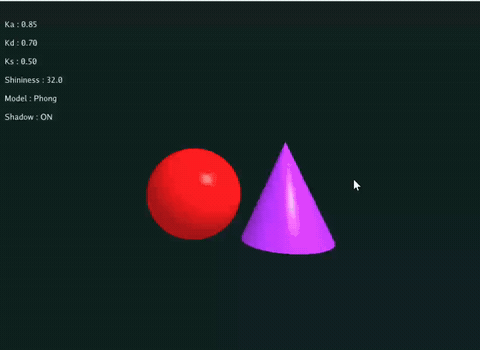

# 实验4：Phong光照模型

## 实验简介

> 学号：202411081111 | 姓名：杨富圆 | 专业：人工智能

基于 Taichi 实现交互式 Phong / Blinn-Phong 光照渲染系统，包含光线投射、几何体解析求交、深度遮挡测试与实时硬阴影效果。

## 效果演示

### 基础任务：Phong 光照模型


### 选做1：Blinn-Phong 光照模型


### 选做2：实时硬阴影效果


## 操作说明

| 按键 | 功能 |
|------|------|
| `P` | 切换 Phong / Blinn-Phong 光照模型 |
| `T` | 开启/关闭 硬阴影效果 |
| `Q` / `A` | 增加 / 减少 环境光系数 Ka |
| `W` / `S` | 增加 / 减少 漫反射系数 Kd |
| `E` / `D` | 增加 / 减少 镜面高光系数 Ks |
| `R` / `F` | 增加 / 减少 高光指数 Shininess |
| `ESC` | 退出程序 |


## 运行方式

```bash
pip install taichi
python main.py
```

## 实现说明

### 基础：Phong 光照模型与光线投射

采用 光线投射（Ray Casting） 为每个像素生成射线，数学隐式构建红色球体与紫色圆锥；通过深度测试（Z-buffer）选择最近交点，按 Phong 公式合成环境光、漫反射、镜面高光三部分颜色。
### 基础：几何体求交与深度测试
实现球体、圆锥的解析求交，并行计算射线交点距离；通过深度竞争确保正确遮挡，在交点处求解表面法向量，用于后续光照计算。
### 选做 1：Blinn-Phong 模型
引入半程向量 H 替代反射向量 R，高光计算更高效、边缘更柔和；支持一键切换标准 Phong 与 Blinn-Phong，直观对比两者视觉差异。
### 选做 2：实时硬阴影
从表面交点向光源发射阴影射线，检测途中是否被其他几何体遮挡；被遮挡区域仅保留环境光，未遮挡区域正常计算完整光照，实现硬阴影效果。
### 实验说明：
- 本实验适用于北师大人工智能学院计算机图形学实验四作业
