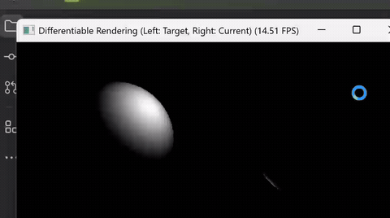

# 实验六：可微渲染 Differentiable Rendering

> 课程：计算机图形学 | 授课教师：张鸿文 | 助教：张怡冉
> 课程主页：https://zhanghongwen.cn/cg

## 效果演示



左侧为目标图像（Ground Truth），右侧为当前渲染图。光源从初始的错误位置（球体背面）逐步收敛至目标位置，高光斑平滑移动直至两图完全重合。

---

## 实验原理

本实验基于 **Taichi AutoDiff** 构建完整的"渲染 → 计算误差 → 反向传播 → 更新参数"闭环，通过梯度下降反向优化三维场景参数。

### 正向渲染（Ray Casting）

对屏幕上每个像素发射射线，计算其与球体的交点及该点的法线与光照，输出渲染图像。

### Leaky Lambertian 光照模型

标准 Lambertian 模型 `I = max(0, n·l)` 在光源位于背面时梯度严格为零，优化陷入停滞。为此采用 **Leaky Lambertian**：

```
I = max(α * (n·l),  n·l)
```

其中 `α = 0.1`，使背光面保留微小梯度，引导光源"穿越黑暗"绕到正面。

### 损失函数

使用均方误差（MSE）衡量当前渲染图与目标图的差异：

```
L = (1/N) * Σ (I_render - I_target)²
```

### Adam 优化器

使用 Adam 而非 SGD，引入动量机制，收敛更快更稳定。光源在逼近目标时可能出现轻微超调，随后快速稳定。

---

## 场景配置

| 参数 | 值 |
|---|---|
| 球体中心 | (0.5, 0.5, 0.5) |
| 球体半径 | 0.3 |
| 目标光源位置 | (0.8, 0.8, 0.2) |
| 初始光源位置 | (0.2, 0.2, 0.8)（位于球体背面）|
| Leaky 系数 α | 0.1 |

---

## 运行方法

```bash
pip install taichi
python main.py
```

程序启动后，终端实时输出 Loss 与光源坐标变化；GUI 窗口并排显示目标图与当前渲染图。

---

## 优化过程说明

1. **初期**：光源位于背面，Leaky 机制提供微小梯度，Loss 下降缓慢但光源坐标持续向正面移动。
2. **转折**：光源绕至正面后，Loss 发生断崖式下降。
3. **收敛**：Adam 动量使参数平滑逼近目标 (0.8, 0.8, 0.2)，最终稳定。

---

### 实验说明：
- 本实验适用于北师大人工智能学院计算机图形学实验六作业